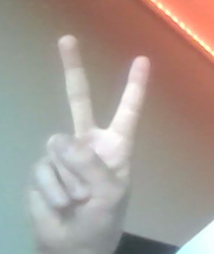
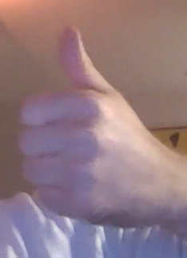
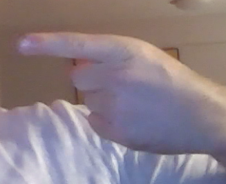

# VirtualVirtuoso
IKT213 - Machine vision project

VirtualVirtuoso is a project that aims to build a machine vision powered guitar, allowing for an innovative and interactive music experience. With this innovative technology, and creating notes through gestures we aim to take you on a unique musical journey.

## Table of Contents
- [How to play](#how-to-play)
- [Gestures](#gestures)
- [Features](#features)
- [Dependency installation](#dependency-instalation)

## How to play
Playing the guitar with VirtualVirtuoso is easy. All it takes is a webcam and a computer with python installed.
In order to play, you need to make gestures. One with the left hand, and one with the right hand. For the available
gestures see the [Gestures](#gestures) section.

There application consists of two different modes.
When starting the application, the 
active mode is **chord strumming**. In this mode you can play chords in two ways. 
1. By moving forming a thumbs up with your right hand, and then moving the tip of your thumb from above to below the upper string, or the other way around.
2. By moving the tip of your index finger over a string, you will play the note of that string. 

The second mode is single string picking. In this mode you can play single notes by moving the tip of your index finger over a string.

To switch to the second mode, make sure both of your hands are in the frame, and make a thumbs down gesture with your right hand.
To switch back to the first mode, make sure both of your hands are in the frame, and make a peace sign with your right hand.

## Gestures
The left hand gestures in VirtualVirtuoso are consistent. This means that you use the same left hand gesture for both modes.
For example, if you play the chord C in the first mode and switch to the second mode, the same left hand gesture will play the note C.
These are the available gestures:

| Left Hand Gestures                                | Picture                                                    |
|---------------------------------------------------|------------------------------------------------------------|
| C major and C tone                                |               |
| D minor and D tone                                | .    |
| E minor and E tone                                | .          |
| F major and F tone                                | . |
| G major and G tone                                | .       |
| A minor and A tone                                | .       |
| B diminished and B tone                           | .                               |


| Right Hand Gestures                                                     | Picture                                               |
|-------------------------------------------------------------------------|-------------------------------------------------------|
| By forming the open palm gesture with both hands, mode will switch to 1 |      |
| By forming the victory gesture with both hands, mode will switch to 2   |        | 
| Play full chord (mode 1)                                                |             |
| Strum chord string by string (mode 1) play single note (mode 2)         |  |


## Dependency installation
pip install -r requirements.txt


## Usage
```bash
python main.py
```

